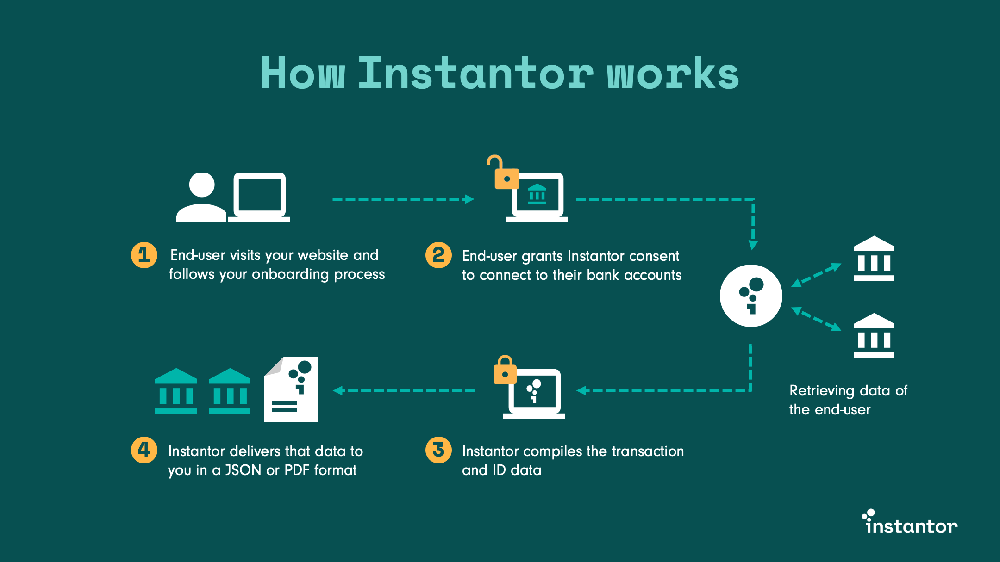

# Introduction

Welcome to the Instantor API documentation page! Here you can find all the information on how to integrate with and use the Instantor Widget on your website. This documentation consists of two parts, the integration of our customer facing frontend solution into your website and the delivery of our reports to you.

The frontend facing solution you will integrate by embedding a code snippet on your website within your loan application flow.

Once a loan applicant has entered the Instantor process, the data collected from the bank will be encrypted and send as HTTP POST request to a client's predefined endpoint URL. Meaning you will be required to provide a callback URL to Instantor. Once you have received the report in a JSON object, you will be able to use your decision engine based on the data we provide.  

| Glossary |  |
| :--- | :--- |
| Widget | The Instantor Widget is integrated into the _client's_ website, providing access to Instantor's services. |
| Client | Banks, financial service providers and FinTech's partnering with Instantor. |
| Customer | The loan applicant in the _client_ onboarding flow. |
| Product Key | A unique identifier for your product configuration |
| Decryption Key | A key used to decrypt the report delivered to you |
| Callback URL | An endpoint ****within your IT infrastructure, that can receive the encrypted reports |

### Not already a client?

Reach out to our team at [our website](https://www.instantor.com/) or [send us an email](mailto:commercial@instantor.com) and we'll happily tell you more about our services.

[start@instantor.com ](mailto:start@instantor.com)

